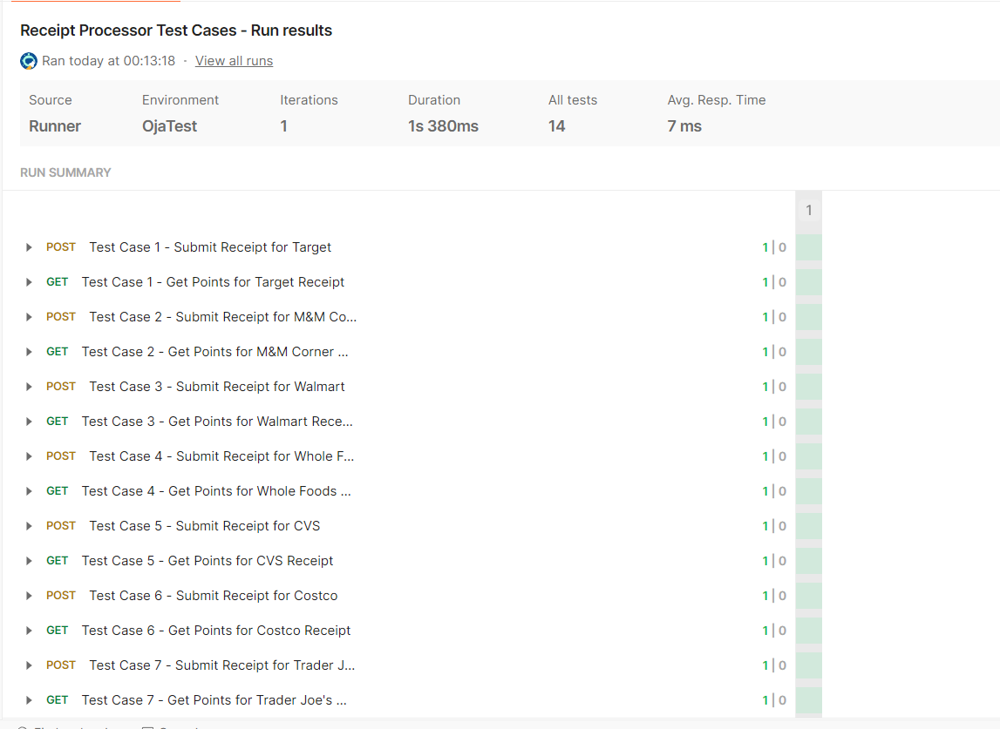

# Receipt Processor

A simple Java application that processes receipts and return points based on certain [rules](https://github.com/fetch-rewards/receipt-processor-challenge?tab=readme-ov-file#rules).

[Fetch Rewards Challenge](https://github.com/fetch-rewards/receipt-processor-challenge)

## Features

- Add and save receipts
- Maintain processing state for each receipt
- Award points for a given receipt based on the rules mentioned above.
- Simple command-line interface for testing
- Added asynchronous processing of receipts

## Technologies Used

- Java 17
- Spring Boot
- JUnit
- Mockito
- Docker

## Getting Started

### Prerequisites

- Java 17
- Maven
- Docker (optional, for containerization)

### Running the Application Locally

1. Clone the repository:

   ```bash
   git clone https://github.com/ritvij-saxena/receipt-processor-challenge.git
   cd receipt-processor
   ```

2. Build the project using Maven
    ```bash
    mvn clean install
    ```   
3. Run the application
    ```bash
    mvn spring-boot:run
    ```
### Running tests
To run the tests, use the command:
```bash
  mvn test
```

### Docker
#### Building the Docker Image
To build the Docker image, run the following command from the root of the project directory (where the Dockerfile is located):
```bash
docker build -t receipt-processor .
```

#### Running the Docker Container
After building the image, you can run the application in a Docker container using:
```bash
docker run -p 8080:8080 receipt-processor
```


## Endpoints
You can interact with the application via the following endpoints [(refer challenge for more details)](https://github.com/fetch-rewards/receipt-processor-challenge?tab=readme-ov-file#summary-of-api-specification):

- `POST /receipts: Add a new receipt`
- `GET /receipts/{id}/points: Retrieve points for a given receipt id`
- `GET /receipts/{id}/receipt: Retrieve a receipt for a given receipt id` 
  Note: (out-of-scope) (Added just for the sake of it)

## Testing with Postman
A Postman collection/test suite file, `Receipt Processor Test Cases.postman_collection.json`, is included with the project. You can import this file into Postman as a collection. Once imported, ensure the server is running and execute the test suite to validate the application's functionality. 



Helpful Links:
- [Importing data in Postman](https://learning.postman.com/docs/getting-started/importing-and-exporting/importing-data/)
- [Running a Test suite](https://learning.postman.com/docs/tests-and-scripts/run-tests/run-tests-manually/)
- [Postman Learning Centre](https://learning.postman.com/docs/introduction/overview/)

### Improvements (Food for thought)
#### 1. Connectivity to Spring Cloud
By integrating with Spring Cloud to support microservices architecture, Spring Boot could be enhanced even more. The app would be more scalable with features like centralized setup (Spring Cloud Config), load balancing (with Netflix Eureka and Ribbon), and service discovery.


#### 2. Improvements to Unit and Integration Testing
The project could use Spring Test for end-to-end integration tests, mocking HTTP requests and responses more successfully with the help of tools like WireMock, while JUnit and Mockito are used for unit testing.

#### 3. Integration with Swagger

To automatically generate interactive API documentation and to facilitate endpoint testing from the browser or Postman, incorporate Swagger into your API documentation.

#### 4. Kubernetes & Docker

Utilizing Kubernetes for deployment will further containerize the application and guarantee that it can grow across numerous instances. Additionally, you may incorporate liveness probes and health checks to improve microservices monitoring.

#### 5. Persistent Data Store

Integrate a persistent database such as MySQL, PostgreSQL, or MongoDB to store receipts and points. This will ensure data survives application restarts and scales better.

We can certainly explore the trade-offs and find the "mostly" correct answer for this problem.

## Acknowledgment

I want to extend a big thank you to Fetch Rewards for offering such an awesome learning experience. This challenge has really helped me deepen my understanding of machine learning workflows—from data preprocessing and modeling to deployment and UI design. It’s been both tough and rewarding, providing a great chance to apply theory to a real-world problem.

I’d love the opportunity to interview with Fetch!
  


